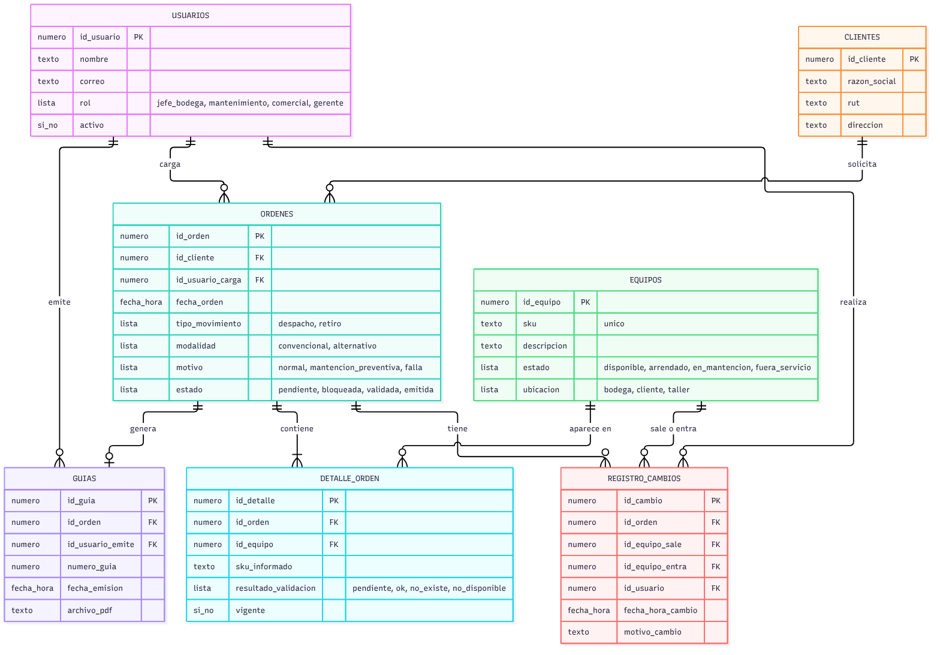
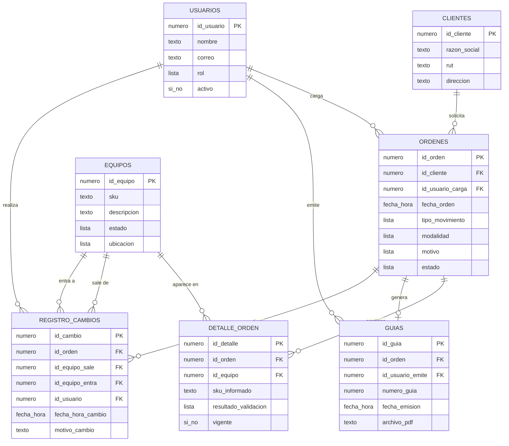

# Estructura de datos preliminar

Grupo 6 · Automatizacion_bodega · Versión del 2026-10-04 (Avance 3)

Las tablas salen de los sustantivos del caso de uso del Avance 2 (emisión automática de guía): cliente, usuario, orden, equipo, detalle de orden, guía y cambio de último minuto. Este es el diseño preliminar; todavía no se crea la base en Supabase.

> El MVP actual usa SQLite con tres tablas (`inventario`, `ordenes`, `log_cambios`), definidas en `src/app.py`. Este modelo es el objetivo: separa la orden de su detalle, agrega `CLIENTES`, `USUARIOS` y `GUIAS`, y reemplaza `log_cambios` por `REGISTRO_CAMBIOS`.

## 1. Diagrama de la base de datos

Mismo diagrama en Mermaid, que GitHub dibuja automáticamente:

Cada tabla muestra sus campos con su tipo (texto, número, fecha y hora, sí o no, lista), su clave primaria (PK) y sus claves externas (FK).

## 2. Relaciones y cardinalidad

Las claves externas siempre van en el lado "muchos" de la relación.

| Relación | Cardinalidad | Se lee |
|---|---|---|
| CLIENTES → ORDENES | 1 : N | un cliente tiene muchas órdenes; cada orden es de un solo cliente |
| USUARIOS → ORDENES | 1 : N | un usuario carga muchas órdenes |
| ORDENES → DETALLE_ORDEN | 1 : N | una orden tiene muchos SKU (pueden ser más de 50), uno por fila |
| EQUIPOS → DETALLE_ORDEN | 1 : N | un equipo aparece en muchas órdenes a lo largo del tiempo |
| ORDENES → GUIAS | 1 : 1 | una orden genera una sola guía (ninguna mientras está bloqueada) |
| USUARIOS → GUIAS | 1 : N | un jefe de bodega emite muchas guías |
| ORDENES → REGISTRO_CAMBIOS | 1 : N | una orden puede tener varios cambios de último minuto |
| EQUIPOS → REGISTRO_CAMBIOS | 1 : N (dos veces) | un equipo puede salir de muchos cambios y entrar en muchos |
| USUARIOS → REGISTRO_CAMBIOS | 1 : N | cada cambio queda firmado por quien lo hizo |

## 3. Decisiones de diseño

- **Un SKU por fila en DETALLE_ORDEN.** Nunca se escriben varios SKU en una sola celda separados por comas.
- **Claves externas en vez de nombres.** La orden guarda `id_cliente`, no el nombre del cliente.
- **SKU_INFORMADO** guarda el SKU tal como llegó en el listado. Si no existe en EQUIPOS, `id_equipo` queda vacío, la validación marca `no_existe` y la orden pasa a `bloqueada`, que es la extensión del caso de uso.
- **VIGENTE** conserva el historial: cuando un equipo se cambia a último minuto, la línea antigua no se borra, sino que queda `vigente = no` y se agrega la nueva. La guía sólo usa las líneas vigentes.
- Los accesorios genéricos sin SKU (ductos, transiciones), que se cortan o se dañan en terreno, quedan fuera de este diseño preliminar y se incorporarán en la siguiente versión del modelo.

## 4. Campos obligatorios y ejemplos

Para cada tabla se muestran dos registros de ejemplo. Los campos marcados con `*` son obligatorios (no pueden quedar vacíos); los demás pueden quedar vacíos. Los SKU de las extensiones siguen el formato real de la empresa: en `SD-63A20-0314`, `SD` indica extensión, `63A` el amperaje, `20` los metros y `0314` el número de la unidad. Los demás datos son ilustrativos.

**USUARIOS**

| id_usuario* | nombre* | correo* | rol* | activo* |
|---|---|---|---|---|
| 1 | Pedro Soto | psoto@ejemplo.cl | jefe_bodega | sí |
| 2 | Camila Rojas | crojas@ejemplo.cl | mantenimiento | sí |

**CLIENTES**

| id_cliente* | razon_social* | rut* | direccion* |
|---|---|---|---|
| 10 | Constructora Andes SpA | 76.123.456-7 | Av. Matta 1200, Santiago |
| 11 | Minera Cordillera S.A. | 77.987.654-3 | Camino a Farellones km 12, Lo Barnechea |

**EQUIPOS**

| id_equipo* | sku* | descripcion* | estado* | ubicacion* |
|---|---|---|---|---|
| 501 | SD-63A20-0314 | Extensión 63 A x 20 m | disponible | bodega |
| 502 | SD-63A20-0315 | Extensión 63 A x 20 m | en_mantencion | taller |

**ORDENES**

| id_orden* | id_cliente* | id_usuario_carga* | fecha_orden* | tipo_movimiento* | modalidad* | motivo* | estado* |
|---|---|---|---|---|---|---|---|
| 3001 | 10 | 2 | 2026-10-05 08:15 | despacho | convencional | normal | emitida |
| 3002 | 11 | 2 | 2026-10-05 09:40 | retiro | alternativo | falla | bloqueada |

**DETALLE_ORDEN**

| id_detalle* | id_orden* | id_equipo | sku_informado* | resultado_validacion* | vigente* |
|---|---|---|---|---|---|
| 9001 | 3001 | 501 | SD-63A20-0314 | ok | sí |
| 9002 | 3002 | (vacío) | SD-63A20-9999 | no_existe | sí |

**GUIAS**

| id_guia* | id_orden* | id_usuario_emite* | numero_guia* | fecha_emision* | archivo_pdf |
|---|---|---|---|---|---|
| 70 | 3001 | 1 | 15230 | 2026-10-05 10:02 | guia_15230.pdf |
| 71 | 3003 | 1 | 15231 | 2026-10-05 11:30 | (vacío) |

**REGISTRO_CAMBIOS**

| id_cambio* | id_orden* | id_equipo_sale* | id_equipo_entra* | id_usuario* | fecha_hora_cambio* | motivo_cambio |
|---|---|---|---|---|---|---|
| 1 | 3001 | 502 | 501 | 2 | 2026-10-05 09:55 | La 0315 no pasó prueba eléctrica |
| 2 | 3003 | 504 | 505 | 2 | 2026-10-05 11:10 | (vacío) |
