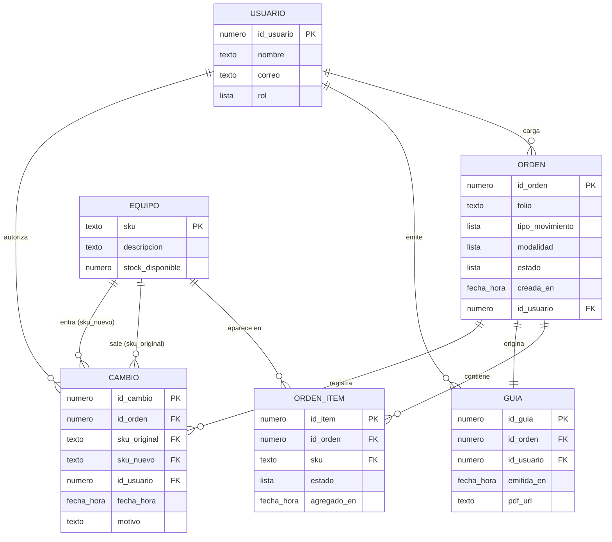

# Estructura de datos preliminar

Grupo 6 · Automatizacion_bodega · Versión del 2026-10-02

Las tablas salen de los sustantivos del caso de uso del Avance 2 (emisión automática de guía): *orden, equipo, inventario, guía, cambio de último minuto, jefe de bodega, mantenimiento*. Este es el diseño objetivo; todavía no se crea la base en Supabase.

> El MVP actual usa SQLite con tres tablas (`inventario`, `ordenes`, `log_cambios`). Este modelo las separa mejor: `ordenes` pasa a ser `ORDEN` + `ORDEN_ITEM` (hoy repite folio, tipo y modalidad en cada SKU), y se agregan `USUARIO` y `GUIA`, que el MVP aún no guarda.

## 1. Diagrama de la base de datos

### Tipos, claves y listas

| Tabla | Campo | Tipo | Clave |
|---|---|---|---|
| USUARIO | id_usuario | número | clave primaria |
| | nombre | texto | |
| | correo | texto | |
| | rol | lista: `mantencion`, `bodega` | |
| EQUIPO | sku | texto | clave primaria |
| | descripcion | texto | |
| | stock_disponible | número | |
| ORDEN | id_orden | número | clave primaria |
| | folio | texto | |
| | tipo_movimiento | lista: `Despacho`, `Retiro` | |
| | modalidad | lista: `Convencional`, `Alternativo`, `Preventivo`, `Por falla` | |
| | estado | lista: `cargada`, `validada`, `bloqueada`, `emitida` | |
| | creada_en | fecha y hora | |
| | id_usuario | número | clave externa → USUARIO |
| ORDEN_ITEM | id_item | número | clave primaria |
| | id_orden | número | clave externa → ORDEN |
| | sku | texto | clave externa → EQUIPO |
| | estado | lista: `cargado`, `reemplazado` | |
| | agregado_en | fecha y hora | |
| GUIA | id_guia | número | clave primaria |
| | id_orden | número | clave externa → ORDEN (única) |
| | id_usuario | número | clave externa → USUARIO |
| | emitida_en | fecha y hora | |
| | pdf_url | texto | |
| CAMBIO | id_cambio | número | clave primaria |
| | id_orden | número | clave externa → ORDEN |
| | sku_original | texto | clave externa → EQUIPO |
| | sku_nuevo | texto | clave externa → EQUIPO |
| | id_usuario | número | clave externa → USUARIO |
| | fecha_hora | fecha y hora | |
| | motivo | texto | |

### Relaciones y cardinalidad

Las claves externas viven siempre en el lado "muchos".

| Relación | Cardinalidad | Se lee |
|---|---|---|
| USUARIO → ORDEN | 1 : N | un usuario carga muchas órdenes |
| ORDEN → ORDEN_ITEM | 1 : N | una orden tiene muchos SKU |
| EQUIPO → ORDEN_ITEM | 1 : N | un equipo aparece en muchas órdenes a lo largo del tiempo |
| ORDEN → GUIA | 1 : 1 | una orden origina una sola guía |
| USUARIO → GUIA | 1 : N | un usuario emite muchas guías |
| ORDEN → CAMBIO | 1 : N | una orden puede tener varios cambios de último minuto |
| USUARIO → CAMBIO | 1 : N | un usuario autoriza muchos cambios |
| EQUIPO → CAMBIO | 1 : N (dos veces) | un equipo sale de muchos cambios (`sku_original`) y entra en muchos (`sku_nuevo`) |

## 2. Campos obligatorios y ejemplos

`*` = obligatorio (no puede quedar vacío). Los campos sin `*` son opcionales.

### USUARIO
Obligatorios: `id_usuario*`, `nombre*`, `correo*`, `rol*`.

| id_usuario* | nombre* | correo* | rol* |
|---|---|---|---|
| 1 | Marcela Soto | msoto@ejemplo.cl | bodega |
| 2 | Pedro Fuentes | pfuentes@ejemplo.cl | mantencion |

### EQUIPO
Obligatorios: `sku*`, `descripcion*`, `stock_disponible*`.

| sku* | descripcion* | stock_disponible* |
|---|---|---|
| MON-050 | Montacargas 3T | 0 |
| PLA-060 | Plataforma elevadora tijera | 8 |

### ORDEN
Obligatorios: todos los campos.

| id_orden* | folio* | tipo_movimiento* | modalidad* | estado* | creada_en* | id_usuario* |
|---|---|---|---|---|---|---|
| 1 | GUIA-2026-001 | Despacho | Convencional | emitida | 2026-10-01 08:15 | 2 |
| 2 | GUIA-2026-002 | Retiro | Por falla | bloqueada | 2026-10-01 09:40 | 2 |

### ORDEN_ITEM
Obligatorios: todos los campos.

| id_item* | id_orden* | sku* | estado* | agregado_en* |
|---|---|---|---|---|
| 1 | 1 | MON-050 | reemplazado | 2026-10-01 08:15 |
| 2 | 1 | PLA-060 | cargado | 2026-10-01 10:02 |

### GUIA
Obligatorios: `id_guia*`, `id_orden*`, `id_usuario*`, `emitida_en*`. `pdf_url` es opcional: queda vacío mientras no se genere el PDF.

| id_guia* | id_orden* | id_usuario* | emitida_en* | pdf_url |
|---|---|---|---|---|
| 1 | 1 | 1 | 2026-10-01 10:10 | guias/GUIA-2026-001.pdf |
| 2 | 2 | 1 | 2026-10-01 11:30 | |

### CAMBIO
Obligatorios: `id_cambio*`, `id_orden*`, `sku_original*`, `sku_nuevo*`, `id_usuario*`, `fecha_hora*`. `motivo` es opcional.

| id_cambio* | id_orden* | sku_original* | sku_nuevo* | id_usuario* | fecha_hora* | motivo |
|---|---|---|---|---|---|---|
| 1 | 1 | MON-050 | PLA-060 | 2 | 2026-10-01 10:02 | Sin stock del montacargas |
| 2 | 2 | EXC-001 | EXC-002 | 2 | 2026-10-01 10:45 | |
