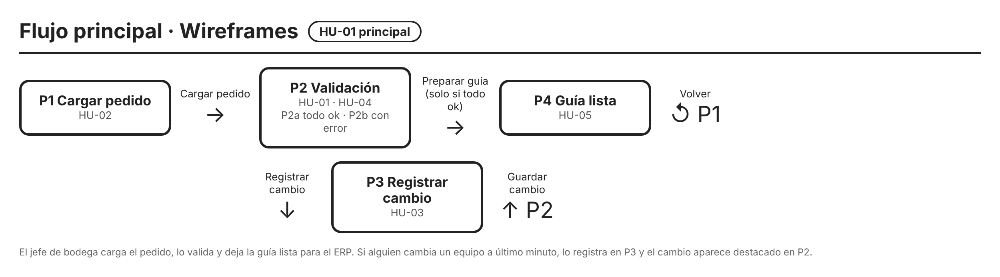
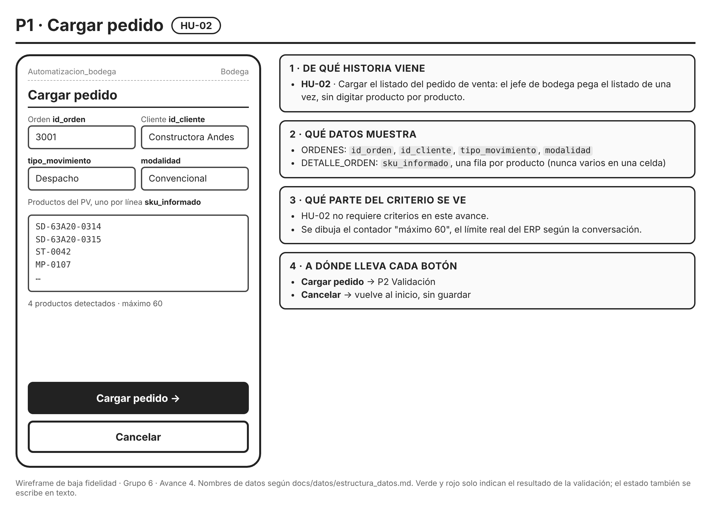
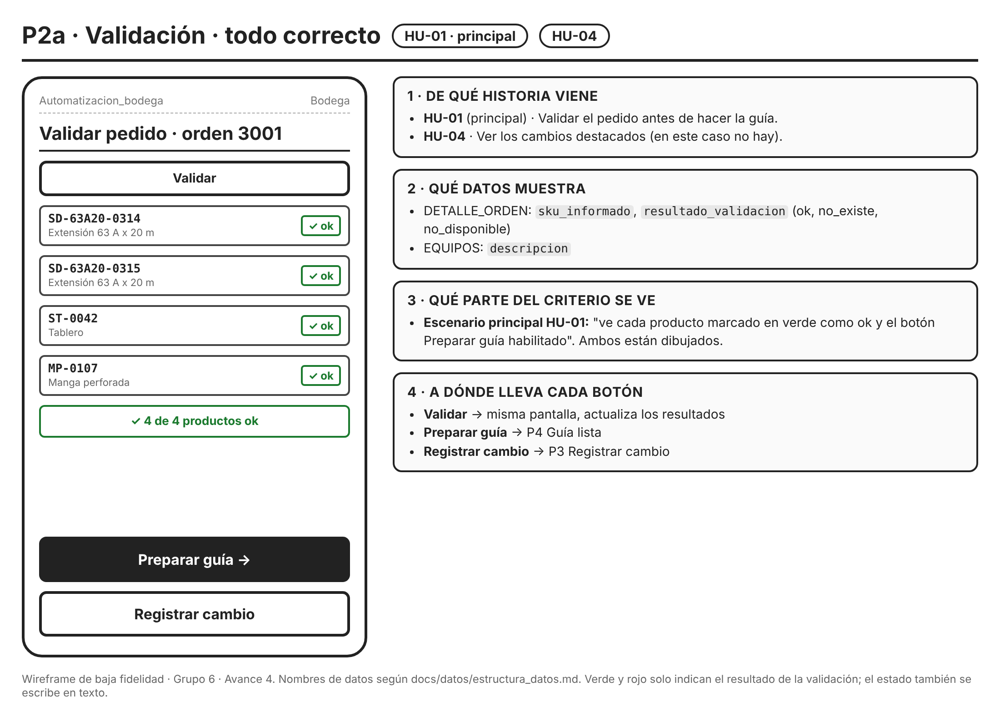
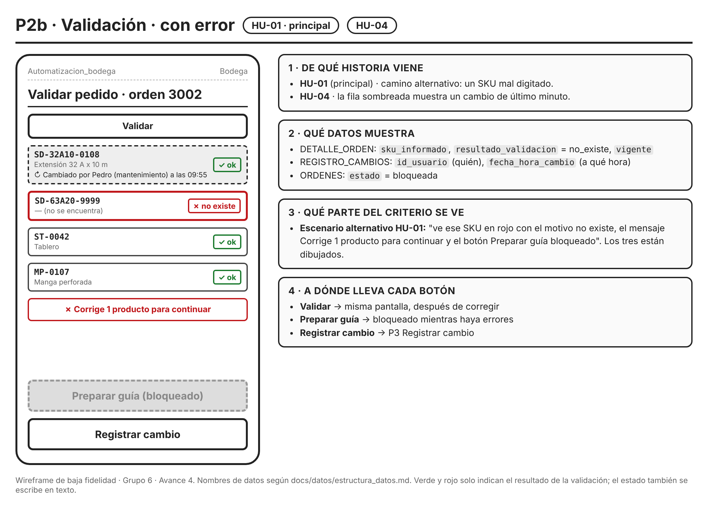
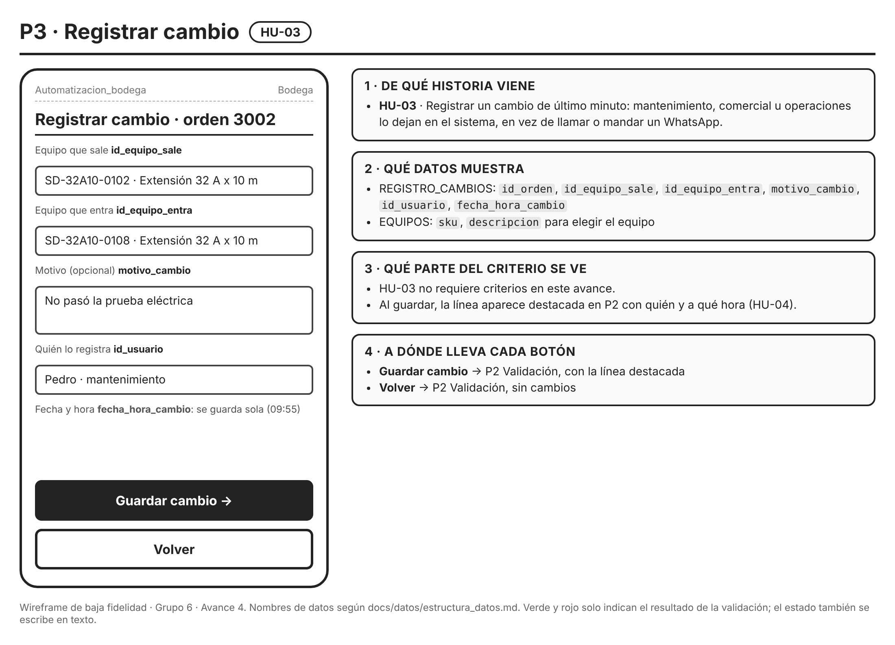
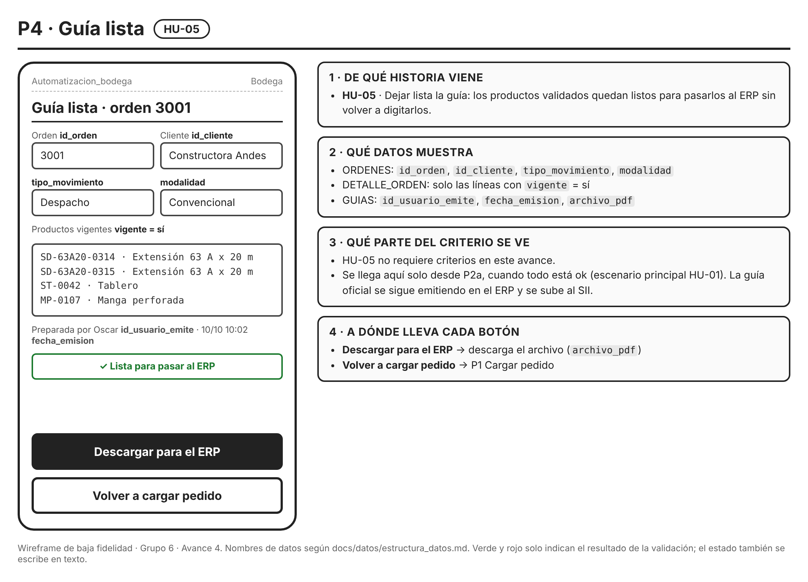

# Wireframes del flujo principal

Grupo 6 · Automatizacion_bodega · Avance 4

El jefe de bodega carga el pedido, lo valida contra el inventario y deja la guía lista para el ERP. Si alguien cambia un equipo a último minuto, lo registra en P3 y el cambio aparece destacado en P2. Las historias están en [docs/historias.md](../historias.md) y los nombres de los datos salen de [docs/datos/estructura_datos.md](../datos/estructura_datos.md).

| Pantalla | Historia | Botones y destino |
|---|---|---|
| [P1 · Cargar pedido](P1_cargar_pedido.png) | HU-02 | Cargar pedido → P2 · Cancelar → inicio |
| [P2a · Validación, todo correcto](P2a_validacion_ok.png) | HU-01 (principal), HU-04 | Validar → P2 · Preparar guía → P4 · Registrar cambio → P3 |
| [P2b · Validación, con error](P2b_validacion_error.png) | HU-01 (principal), HU-04 | Validar → P2 · Preparar guía bloqueado · Registrar cambio → P3 |
| [P3 · Registrar cambio](P3_registrar_cambio.png) | HU-03 | Guardar cambio → P2 · Volver → P2 |
| [P4 · Guía lista](P4_guia_lista.png) | HU-05 | Descargar para el ERP · Volver → P1 |

P2a y P2b son la misma pantalla en los dos escenarios de la HU-01: P2a dibuja el escenario principal y P2b el alternativo. Cada imagen lleva sus cuatro notas: de qué historia viene, qué datos muestra, qué parte del criterio se ve y a dónde lleva cada botón.

## P1 · Cargar pedido

## P2a · Validación, todo correcto

## P2b · Validación, con error

## P3 · Registrar cambio

## P4 · Guía lista

